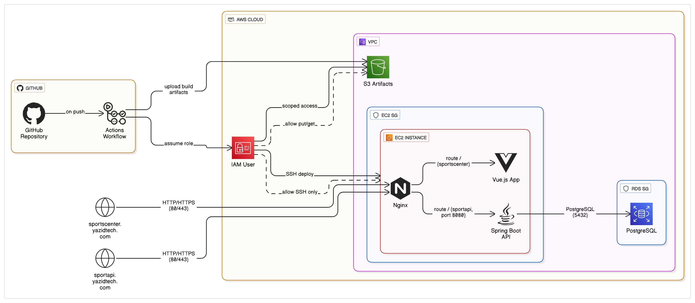

# 🏟️ SportsCenter App – Self-Hosted Version by Yazid Asselah

🛠️ **Technologies Used**: Vue.js • Java Spring Boot • PostgreSQL (RDS) • AWS EC2 • AWS RDS • AWS S3 • GitHub Actions • Nginx

🚀 This version of the app is fully deployed on a custom AWS infrastructure for learning and portfolio purposes!  
🛠️ Everything is hosted on a single EC2 instance (due to AWS free tier 😅), with the database on Amazon RDS and CI/CD powered by GitHub Actions.  
🌐 Live App: [sportscenter.yazidtech.com](https://sportscenter.yazidtech.com)

### 📸 Architecture Overview

---

# ECSE 321 - W2024 - Group 11 - Sports Center App

## 📊 Project Overview
This project involves developing a web application for a local sport center to manage classes, schedules, and customer registrations. It supports different user roles: owner, instructors, and customers, with functionalities accessible via a web frontend.

Further documentation is available on the [project wiki](https://github.com/McGill-ECSE321-Winter2024/project-group-11/wiki).

---

## 📅 Deliverable 1
**[Project Report](https://github.com/McGill-ECSE321-Winter2024/project-group-11/wiki)**

| Team Member       | Responsibilities                                                                                                  | Hours (incl. meetings) |
|-------------------|-------------------------------------------------------------------------------------------------------------------|------------------------|
| **Yazid Asselah** | Domain model, requirement drafts, use case diagrams & specification #1, persistence layer testing                | 22                     |
| **Kenny Nguyen**  | Requirements draft/final, use case spec #2, general documentation                                                 | 22                     |
| **Liam Di Chiro** | Domain model, use case spec #3, persistence layer + tests                                                         | 21                     |
| **Seungyeon Lee** | Domain model, use case spec #4, test suite for persistence layer                                                  | 23                     |
| **Luke Freund**   | Domain model verification, Umple code generation, use case spec #5, documentation                                 | 24                     |

---

## 📅 Deliverable 2
**[Project Report](https://github.com/McGill-ECSE321-Winter2024/project-group-11/wiki)**

| Team Member       | API Responsibilities                                   | Hours |
|-------------------|--------------------------------------------------------|--------|
| **Yazid Asselah** | ClassType and Instructor API                          | 20     |
| **Kenny Nguyen**  | User/Login/Authentication API                         | 21     |
| **Liam Di Chiro** | Owner and Customer API                                | 19     |
| **Seungyeon Lee** | Session API                                           | 21     |
| **Luke Freund**   | Registration API                                      | 20     |

Classes were split up between members. Each was responsible for their API’s Service, Controller, DTOs, and tests.

---

## 📅 Deliverable 3
**[Project Report](https://github.com/McGill-ECSE321-Winter2024/project-group-11/wiki)**

| Team Member       | Frontend Responsibilities                                            | Hours |
|-------------------|----------------------------------------------------------------------|--------|
| **Yazid Asselah** | Home, Classes, Profile, Center Infos, and Sessions UI pages         | 40     |
| **Kenny Nguyen**  | Class Types UI page                                                  | 25     |
| **Liam Di Chiro** | Registration UI page                                                 | 26     |
| **Seungyeon Lee** | Instructors UI page                                                  | 28     |
| **Luke Freund**   | About, Classes, Instructors (Dashboard) UI pages                     | 25     |

---

### 🚀 Technologies Used
- Frontend: Vue.js
- Backend: Java Spring Boot
- Database: PostgreSQL (RDS)
- Hosting: AWS EC2 + RDS + S3
- CI/CD: GitHub Actions
- Proxy & Routing: Nginx

---

Want to deploy it yourself? Let me know — happy to help! 🚀
